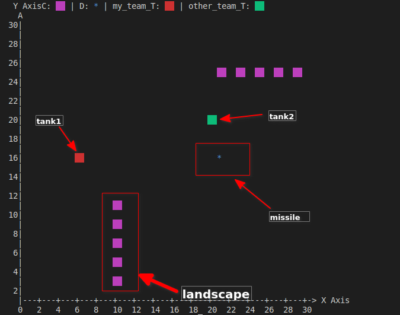

# Dendi-tanks

## Main idea:

I wanna create analog dendi tanks, but online. And on this project I will study to use Nest framework.

Ws-server has with horizontal-scalable on Nest framework. Communication: REST api and custom json-RPC across web-socket (real-time api for game).

Prerequisites:

- nodejs v12.22.9 or above
- docker-compose

```
# cloning repo
1) git clone https://github.com/feldek/nest_dendi_tanks.git
2) cd nest_dendi_tanks
3) npm i
4) cp .env.sample .env

# running docker
5) sudo docker-compose up

# running migrations
6) npm run migrate

# for launch 2 node instances
7) npm run start:pm2
# or (launch 1 instances in dev mode)
7) npm run start:dev
```

### Launch with console-ui:

There is to display ui via console - is a bad idea (but frontend doesn't exist now)

Prerequisites: ts-node

```
ts-node test/utils/ws-client/launch.ts
```

Win that, who destroy enemy team. (by default need 5 shots for tank)
There is delay, between shots(1000 ms).

Control: "left" "right" "up" "down" (keyboard arrows)
Shot: "space"
Stay/run: "0"


